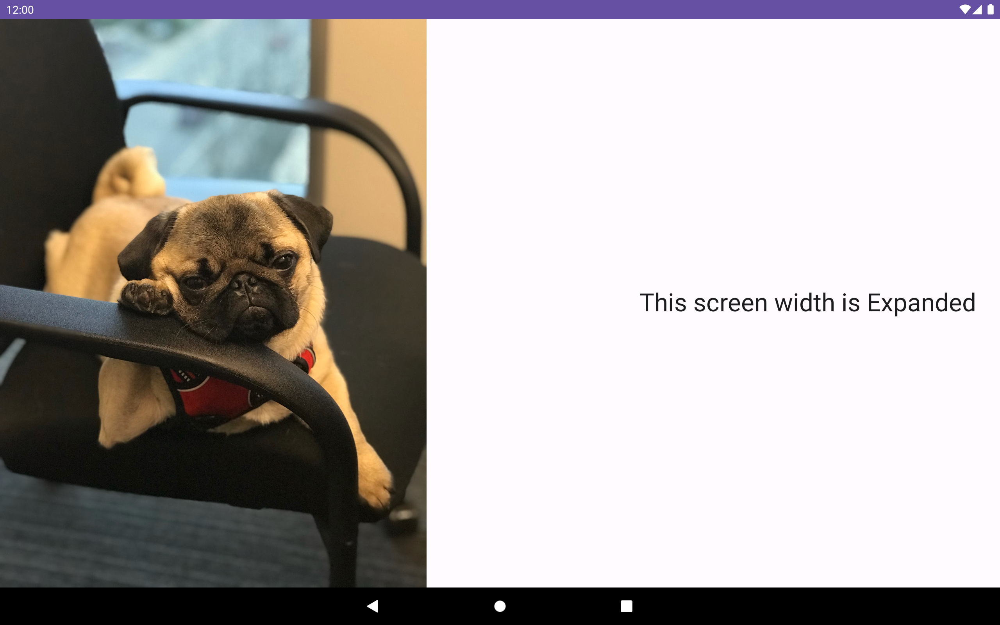
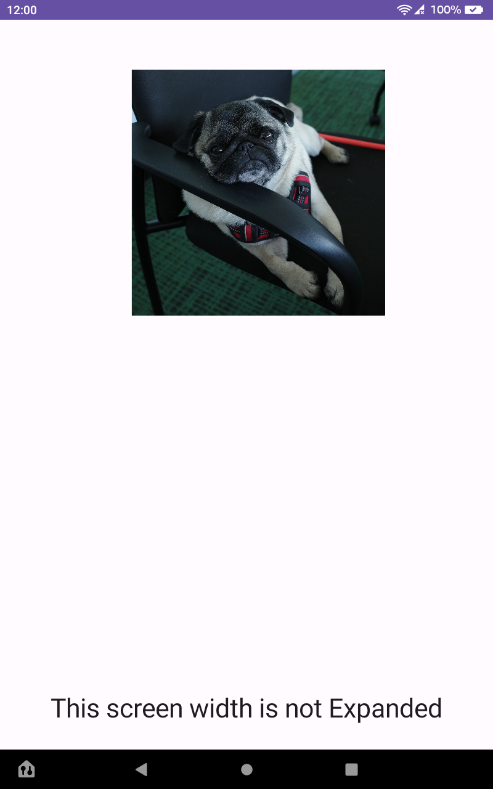

# 🔥 Hello World Fire Tablet App

_Learn how to create a simple Fire Tablet app and get it running in 5 minutes_




This project is a sample Hello World Fire tablet app that detects Google Play Services or Amazon Appstore services and adapts its UI based on the screen orientation using Jetpack Compose. Get your app up and running in just 5 minutes! ⏰📱

## Prerequisites

To run this project, you will need the following:
- Android Studio
- (Optional) Fire tablet 

## ✅ Features

Key features include:
- Creating a simple Hello World Fire app 👋
- Displaying different images based on the availability of Amazon Appstore features or Google Play Services 🖼️
- Use Google Jetpack Compose [adaptive layout](https://developer.android.com/jetpack/compose/layouts/adaptive) to adapt between landscape and portrait modes 🌈

## 💻 Building the Hello World app

1. Clone the repository:

`git clone git@github.com:AmazonAppDev/hello-world-fire-tablet.git`

2. Open the project in Android Studio and wait for Gradle to sync. ⏳
3. Select 'Build' > 'Make Project' to build the app. 🔨
4. Connect an Android emulator or a Fire tablet via USB. See instructions for 🔌 [Connecting to Fire Device through ADB](https://developer.amazon.com/docs/fire-tablets/connecting-adb-to-device.html)
5. Choose 'Run' > 'Run app' to launch the app on your device or emulator. ▶️
6. Rotate your screen to see the adaptive layout in action! 🔄

## 💡 Key pointers to look at
#### Check Google Play Service availability
By using [GoogleApiAvailability](https://developers.google.com/android/reference/com/google/android/gms/common/GoogleApiAvailability) class, we create a new function to verify if Google Play Services are available.
```kotlin
private fun isGooglePlayServicesAvailable(): Boolean {
        val googleApiAvailability: GoogleApiAvailability = GoogleApiAvailability.getInstance()
        val status: Int = googleApiAvailability.isGooglePlayServicesAvailable(this@MainActivity)
        return status == ConnectionResult.SUCCESS
}
```
#### Determine device orientation
By utilizing [calculateWindowSizeClass](https://developer.android.com/reference/kotlin/androidx/compose/material3/windowsizeclass/package-summary#calculateWindowSizeClass(android.app.Activity)), if it returns WindowWidthSizeClass of Expanded, we know that the device is in landscape mode and can adjust the position of the image and text accordingly:
```kotlin
val isExpandedScreen =
                calculateWindowSizeClass(this).widthSizeClass == WindowWidthSizeClass.Expanded
```
## Get support

If you found a bug or want to suggest a new [feature/use case/sample], please [file an issue](../../issues).

If you have questions, comments, or need help with code, we're here to help:
- on Twitter at [@AmazonAppDev](https://twitter.com/AmazonAppDev)
- on Stack Overflow at the [amazon-appstore](https://stackoverflow.com/questions/tagged/amazon-appstore) tag

Sign up to [stay updated with the developer newsletter](https://m.amazonappservices.com/subscribe-newsletter).

## Authors

- [@_yoolivia](https://twitter.com/_yoolivia)
- [@giolaq](https://github.com/giolaq)

## 📄 License

This project is licensed under the [MIT-0 License](LICENSE).
